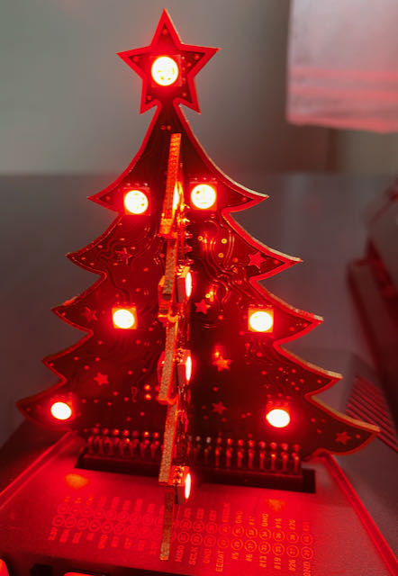

# apa102-pi

## Introduction
Apa102-pi is a pure Python library to drive APA102 and SK9822 type LED strands. It is supposed to work on a Raspberry
Pi, and is not tested on any other platform.

APA102 LEDs are typically 5050 type LEDs with an additional driver chip per LED.
The driver chip takes care of receiving the desired colour via its input lines, and then holding
this colour until a new command arrives.

Depending on the LEDs vendor, they might be called "APA102", "SK9822", "Superled", or "DotStar".
They must not be confused with the three-wire WS2812 LEDs, also known as "NeoPixel".

The really nice part about the driver chip is this: Once it has received its own colour command,
it forwards any further colour commands from its input to its output lines.
This allows to easily chain multiple LEDs together. Colour command #1 lights the first LED,
command #2 the next LED, and so forth. Sending for example 300 colour commands does light
an entire 5 Meter, 60 LEDs per Meter strip.

Some APA102 pictures are available [here](https://tinue.github.io/apa102-pi/)

## Purpose
The library takes care of the details on sending colour commands.
It is supposed to be educational, and is therefore written in Python.
The library is fast enough to produce nice colour effects on a 300 LED strand, even though it is running
via the Python interpreter. However, if you need something really fast, e.g. to drive a
small "display" based on APA102 LEDs with 15 frames per second, then you have to look elsewhere.

## Prerequisites
* A Raspberry Pi, running an up-to-date version of Raspbian / Raspberry Pi OS. To date, Raspberry Pi OS October 30th 2021 (Debian bullseye)
is out, and the library works fine with this release. It should run on all Raspberry Pi models, from Zero
to 4.
* If hardware SPI is used: SPI enabled and active (`raspi-config`, Interface Options, SPI, \<Yes\>);
The SPI must be free and unused.
* For software SPI (bit bang mode): Two free GPIO pins
* Three libraries from Adafruit: [Adafruit-Blinka](https://github.com/adafruit/Adafruit_Blinka), 
[adafruit-circuitpython-bitbangio](https://github.com/adafruit/Adafruit_CircuitPython_BitbangIO),
and [adafruit-circuitpython-busdevice](https://github.com/adafruit/Adafruit_CircuitPython_BusDevice).
These libraries will be installed automatically if you follow the steps in
[Use the APA102 project as a library](#use-the-apa102-project-as-a-library).

For a permanent installation, a 10$ Raspberry Pi Zero W can be dedicated to the task of driving the LEDs.
The connector to the LED stripe would be soldered directly to the correct ports on the board.
For development purposes, a Raspberry Pi 4 Model B is a better choice due to its greater speed.
Even the 1GB model is more than enough for this purpose.

## Wiring
The Raspberry Pi is a 3.3 volt device, and the APA102 LEDs are 5 volt devices. 
Therefore, it is possible that the first LED driver chip does not properly detect the 3.3 volt SPI signal from
the Raspberry Pi.  
The first chip will amplify the signal to 5 volts before passing it on, so it is really only the first chip
that must detect the 3.3 volt signal.  
To avoid this risk, use a 74AHCT125 or 74AHC125 level shifter for both the clock and the MOSI signal.
In my limited testing with four different stripes from various Chinese sources I had no issues without
a level shifter, but your experience might be different.

Without a level shifter, the wiring is very simple:

- LED ground to one of the Raspberry ground pins  
- LED Data to Raspberry SPI MOSI  
- LED Clock to Raspberry SPI SCLK

A note about "chip select": The Raspberry Pi's SPI0 bus has two hardware Chip Select pins: CE0 and CE1. They correspond
to the devices `/dev/spidev0.0` and `/dev/spidev0.1`. A typical SPI device has one Chip Select input line. So, on
a stock Raspberry Pi one can connect two SPI devices: Both share SCLK, MOSI and MISO, and each one uses its own Chip
Select. You might be wondering where the Chip Select input line is on an LED strip. Answer: There is none. You 
therefore can't disable the Strip from reading data on SCLK/MOSI, at least not without additional hardware. For
example, you can wire the chip select GPIO of the Raspberry Pi to the level shifter "output-enable" pin.

The Adafruit library does not use or support the hardware chip select pins of the Raspberry Pi. Instead, any
free GPIO pin can be used. Because this is multiplexed in software, it is very slow. The feature supports
e.g. sensors, where you have a lot of them (more than two), and each sensor only sends or
receives a limited amount of data.  
The apa102-pi library attempts to use this software multiplexing if a CE value is passed on driver initialization.
The strip will update a lot slower if this is used. It is still a bit faster than bitbang, though.
Please note that I have not tested this feature, because I never assembled the hardware required for this.

The LED strip uses a lot of power (roughly 20mA per LED, i.e. 60mA for one bright white dot).
If you try to power the LEDs from the Raspberry Pi 5V output, you will most likely immediately
kill the Raspberry! Therefore, I recommend not to connect the power line of the LED with the Raspberry. 
To be on the safe side, use a separate USB power supply for the Raspberry, and a strong 5V supply 
for the LEDs. If you use a level shifter, power it from the 5V power supply as well.

Having said this, you *can* power the Raspberry from the same power supply as the LED stripes
(instead of using an extra USB power supply). If you decide to do this, make sure to never plug
a USB power supply to the Raspberry Pi, or you risk that the LEDs try to take power through the Raspberry.

All combined, this is my extremely low-tech wiring diagram:

And here it is, the finished contraption running a "rainbow" program:

This is a Raspberry Pi Zero W with a Phat Beat amplifier on top. The amplifier's "VU meter" is simply
a bunch of APA 102 LEDs; They show the "Rainbow" color scheme:

Plugged into the USB port is a WLAN stick (nowadays I use a Raspberry Pi Zero W, of course).
This way I can reprogram the light show from my desk, even if the strips sit outside 
as a Christmas light. Compare this to an Arduino/WS2812 based installation: To reprogram one has
to take the Arduino inside, or a laptop outside.

This is a Raspberry Pi 4 with a 3D RGB Xmas Tree from Pi Hut:

## Quick Raspberry Pi setup
Because the Raspberry Pi Zero runs headless, I recommend using the Raspberry Pi OS *Lite* image.
This image only contains the bare minimum of packages, and some packages have be added manually.

The current Raspberry Pi OS Lite images can easily be set-up to run headless from the start.
After burning the card on a Mac or PC, it will be mounted as "boot". Go to this directory,
and create an empty file named `ssh` to enable SSH.  
On a Mac you would do this: `touch /Volumes/boot/ssh`. To enable and configure WLAN, create
a file named `wpa_supplicant.conf`. Its content should be:  

	country=CH
	ctrl_interface=DIR=/var/run/wpa_supplicant GROUP=netdev
	update_config=1
	
	network={
		ssid="Your_SSID"
		psk="Your_Password"
		key_mgmt=WPA-PSK
	}

Of course, use the correct country and ssid/psk. After booting (be patient: The Pi will initially boot twice)
you can SSH into the Raspberry Pi: `ssh pi@raspberrypi.local`. The initial password
is `raspberry`: Make sure to change it right away!

Next, install additional packages and enable SPI:

- Update your installation (`sudo apt update && sudo apt -y upgrade`).
- Install packages: `sudo apt install -y python3-pip python3-venv python3-rpi.gpio`
- Activate SPI: `sudo raspi-config`; Go to "Interface Options"; Go to "SPI"; Enable SPI;
While you are at it: Do change the default password! Exit the tool and reboot.  

## Use the APA102 project as a library
The library was originally built as an educational piece of software. It shows how the protocol
for APA102 LEDs works. Most of this is explained in the form of comments in the source code.
If you are interested in this, then follow up with the chapter after this one.
If all you need is the library itself for your own projects, then this chapter is enough to get you started.

Install the library like this: `sudo pip3 install apa102-pi`. 
This will install the library, and its dependencies for all users. 

Note: If you want to install the library into a virtual env, you must create the venv with the option `--system-site-packages`. This is necessary to get access to the shared RPi.GPIO library.

To verify the installation, download the test script from Github:
`curl https://raw.githubusercontent.com/tinue/apa102-pi/main/runcolorcycle.py -o runcolorcycle.py`.
To run, type `python3 ./runcolorcycle.py`.
 
## Full installation into a Python virtual environment
To retrieve the full library including source code, and use a virtual env in the process, this is what you need to do:
- Install the git client: `sudo apt install -y git`  
- Prepare GIT: `git config --global user.name "John Doe" && git config --global user.email johndoe@example.com`  
- Create a development directory and change into it: `mkdir ~/Development && cd ~/Development`  
- Get the APA102 Library and sample light programs: `git clone https://github.com/tinue/apa102-pi.git && cd apa102-pi`  
- Create the virtual environment: `python3 -m venv --system-site-packages ./.venv`
- Activate the virtual env: `source .venv/bin/activate`
- Install the library: `pip3 install apa102-pi` (without `sudo`!)
- Uninstall the library again (and keep the dependencies): `pip3 uninstall apa102-pi -y`
- You might want to set the number of LEDs to match your strip: `nano runcolorcycle.py`; Update the number, Ctrl-X and "Yes" to save.  
- Run the sample lightshow: `./runcolorcycle.py`.

## Troubleshooting
### Strip remains dark
The number one reason for this problem is that MOSI and SCLK are swapped. You can't rely on the colors of the wires,
they seem to change with every batch of APA102 strips that are produced. To resolve, swap the two data
wires and try again.  
If it still does not work, then you might need a level shifter. Before you do this, you can try to lower the
supply voltage for the strip. According to the APA102 data sheets, a "one" signal is detected as a percentage of
the supply voltage: The lower the supply voltage, the higher the chance that 3.3 Volts is still detected
as a "one".

### Flicker
Sometimes the end of large stripes flickers. It seems that there is a correlation amongst three variables:
* SPI bus speed
* Overall brightness of the strip
* Length of the strip

It turns out that you can only have two out of three: On a long, bright strip you will have to lower the bus speed 
significantly.  
Check the apa102.py driver: Default is 8MHz (`BUS_SPEED_HZ = 8000000`). You may have to go as low as 1.5MHz, 
i.e. `BUS_SPEED_HZ = 1500000`. This means that all light programs with lots of updates and zero wait
(e.g. rainbow) will run much slower.

### Brightness
There is a default global brightness value in the driver itself (apa102.py, line 90). Of this parameter, the LED
controller chip interprets only the first 5 bits, snd ignores the rest. Therefore, everything >= 31 is 100% brightness.
The value is set to 1/8th of the maximum (i.e. 8), and can be changed either by patching apa102.py, or by setting
the value from your application. Check `sample.py` to see how this is done.

## Release history
- 1.0.0 (2015-04-13): Initial version
- 1.1.0 (2015-12-04): Add documentation
- 1.1.1 (2015-12-11): Rewrote the examples, driver itself is unchanged
- 1.2.0 (2015-12-17): Fixes for reported problems; Update all of the color samples; Decouple number of steps from number of LEDs
- 1.3.0 (2016-03-25): Merged changes from @kapacuk: Allow stripes with different color coding than RGB
- 1.3.1 (2016-03-27): Merged 'rotate' method from @kapacuk; Fixed errors from previous merge
- 1.3.2 (2016-12-25): Fixed error related to 'rotate'; Removed annoying messages on console; Added a debug method
- 1.3.3 (2017-04-14): Merged pull request #19 from @DurandA; Cleanup; Update README.MD, No functional changes
- 1.4.0 (2017-04-16): Update code to better comply with the Python style guide (PEP 8); Merged pull request from @jmb
- 1.4.1 (2017-08-26): Tested with Raspbian Stretch; Update Readme.
- 2.0.0 (2017-11-05): Exchanged the SPI library to Adafruit_Python_GPIO. This allows to support devices that do not use hardware SPI, for example the Pimoroni Blinkt! or the Phat Beat.
- 2.0.1 (2018-01-19): Tiny release: Added a sample
- 2.0.2 (2018-05-25): No change in the driver; Slight restructuring of the templates and schemes to allow easier change of the SPI pins; Additional sample specific to the the Pimoroni Blinkt!
- 2.1.0 (2018-06-08): Make the library installable
- 2.1.1 (2019-03-15): Enable Chip Select (thanks @grandinquisitor); Simplify installation (thanks @nielstron)
- 2.2.0 (2019-03-16): First version that is available on PyPi (pip 3 install); Renamed package for compliancy with PEP 8.
- 2.2.1 (2019-09-20): Nothing new, just a re-test of the library with Raspbian Buster
- 2.3.0 (2019-11-24): Untested fix for SK9822 type LEDs; Fix name space; Update readme. Note: The namespace fix breaks compatibility with the previous version, hence the minor upgrade in the version number.
- 2.4.0 (2020-05-28): SPI: Switch from the deprecated Adafruit_GPIO to the Adafruit CircuitPython libraries; Re-test with Raspberry Pi OS 2020-05-27.
- 2.4.1 (2020-12-04): Remove global brightness parameter from the constructor; Re-test with Raspberry Pi OS 2020-12-02 (kernel 5.4) and latest Adafruit libraries. Fix default global brightness: The "conservative" value of 31 was actually 100%, because this is a 5 bit value. Also changing the branch names in Github to reflect current standards.
- 2.5.0 (2021-12-27): Add methods get_pixel and get_pixel_rgb, support to use all hardware SPI buses on RPI 4 (by explicit choice between hardware spi and bitbanging), thanks @KAN-PC046!  Test with Raspberry Pi OS bullseye and Python 3.9. Add instructions on using a virtual env. Note: The interface changes, so the minor version is getting increased.