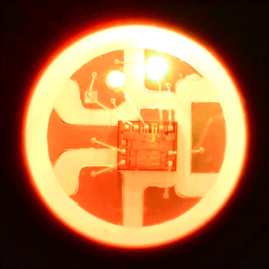
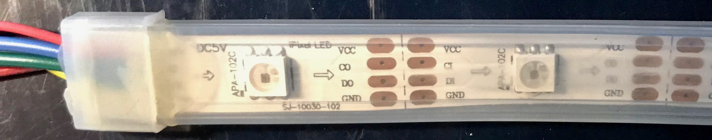
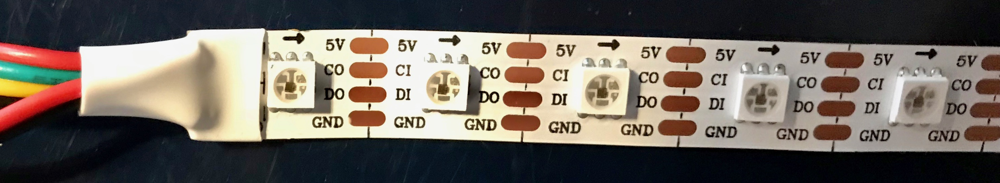
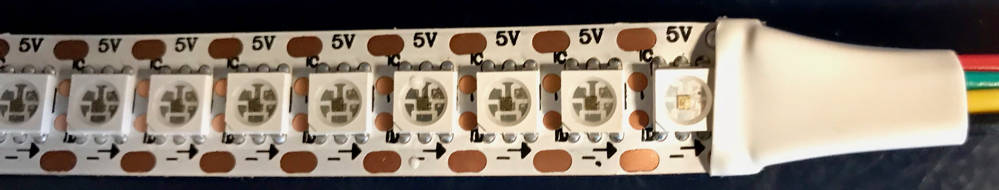
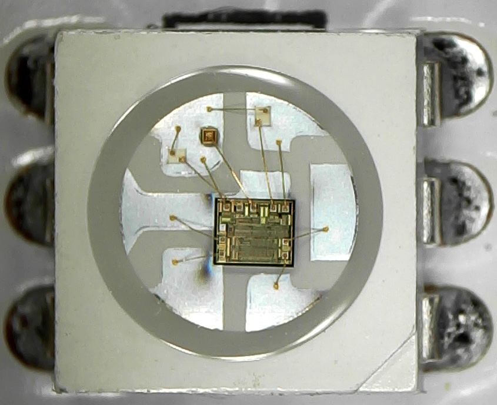
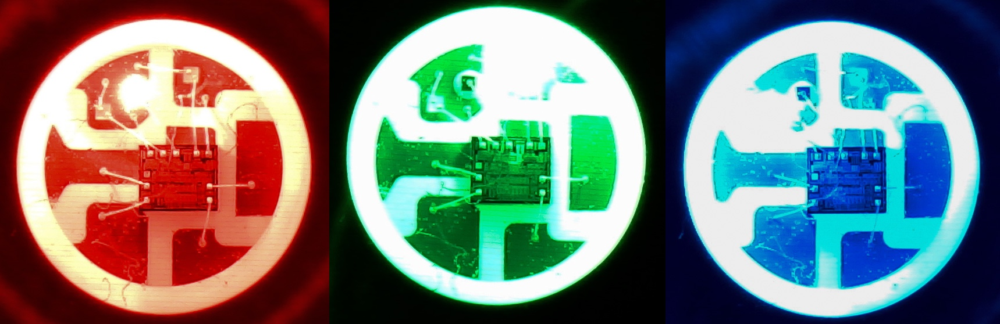
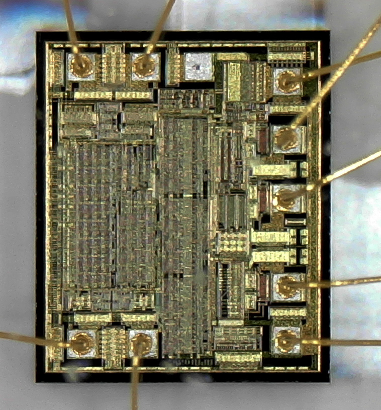
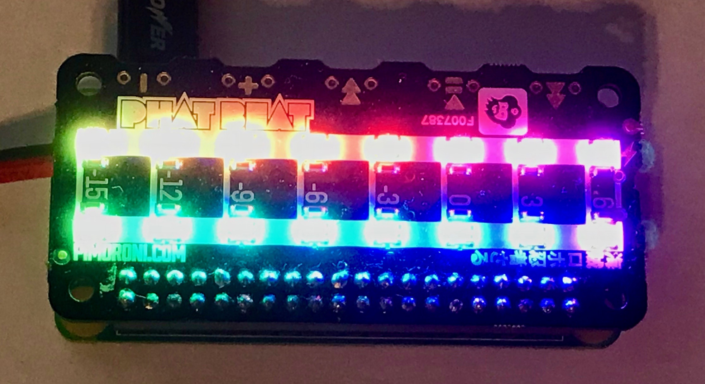

# APA102 LED Pictures
## Introduction
The APA102 die contains three light-emitting diodes (LED) and a controller chip. While a classic RGB LED is controlled via analog voltages, the APA102 is controlled digitally through the controller chip. Typically an individual APA102 element has eight contact points. Four input lines on the “left” side, and four output lines on the “right” side.

Therefore it is really easy (and very common) to assemble many APA102 elements onto a long stripe. Between two LEDs is usually a cut line where the stripe can be separated. The two ends can be re-joined with cable and soldier.

## APA102 stripes
Most vendors sell stripes in three densities: 30, 60 or 144 LEDs per meter. Usually one can choose between a white and a black PCB color, and the level of waterproofing. The lower densities are available in 1m or 5m rolls. The high density 144 per meter stripe seems to only be available as a one meter unit. Here are some pictures:

APA102 LED, 30 per meter with waterproofing

APA102 LED 60 per meter, no waterproofing

High density 144 per meter APA102 LED stripe

## APA102 unit
Under a microscope, the three LEDs, the controller and the cabling is easily visible. The actual LEDs are surprisingly small. They are mounted onto the upper two ground pads.

APA102 LED off

In their “off” state one cannot see which LED is which color. For this, one has to turn them on:

APA102 LED, lit

## Controller
The controller chip looks more complex than an old CPU (e.g. an 8080), and yet it is only used to light up a single RGB LED. We really do live in the future.

APA 102 controller chip

## Other APA102 usages
Apart from the classical LED stripes, the APA102 chips also appear in unexpected places. For example a DAC / Class-D amplifier for the Raspberry Pi Zero, named “Pimoroni Phat Beat”, has a “VU meter” on top. It turns out that these are simply 16 APA102 chips chained together.

Pimoroni Phat Beat with a “rainbow” light effect.